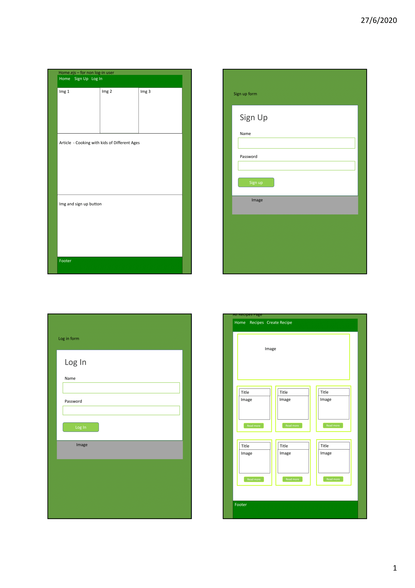
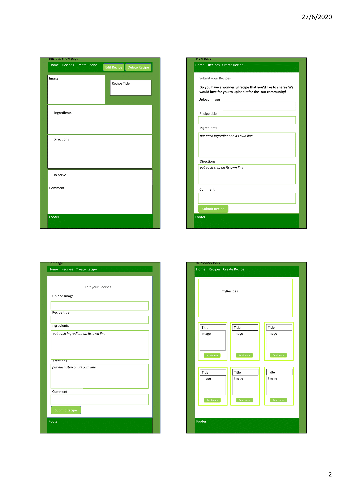
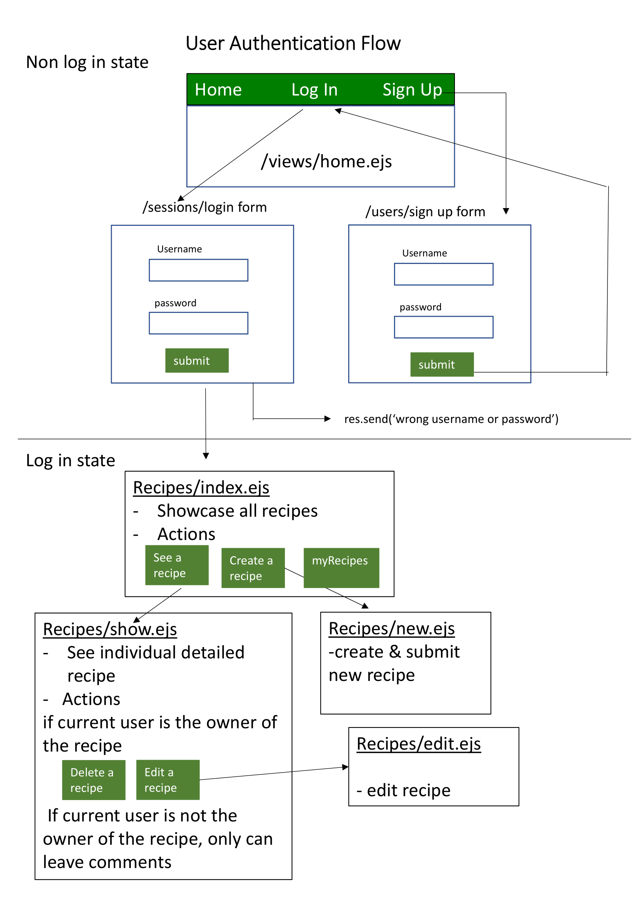

## Table of contents
* Project Title 
* Project Demo
* Project Motivation 
* Technologies 
* Wireframes 
* Project scope and implementation 
* Special features 
* Challenges 
* Improvements 

## Project Title : Kid's Recipes App 

## Project Demo
* https://helen-sew.github.io/kids-recipes/
* https://git.heroku.com/kids-recipes-1.git

## Project motivation 
With the fast pace of our lives and need to produce quick,healthy meals and the ability to hold recipes and ingredients in one handy space becomes a must. This recipe app allows busy parents to find recipes and plan ahead. Parents are allows to create thier own recipes, share with other parents and they are allow to update, delete and leave comments on each recipe. 

## Technologies 
* Node.js, 
* Express
* EJS (use partials)
* TDD - Jest, Chai and Ajv
* User authentication - express-session, bcryt 
* MongoDB
* Bootstrap 
* CSS 

## Wireframes 

## Project scope and implementation : 

### Step 1 : initial set-up of app 
* set up a project folder and run npm init -y and npm install all the dependencies like express, jest, chai, method-override, mongodb, mongo-seeding etc.
* touch server.js to require and use all the dependencies. 
* create db folder > touch recipeSchema.js and set up schema validation for database at MongoDB compass. 
* Inside db folder > touch and set up index.js and connect MongoDB in server.js.

### Step 2 - perform test driven development (TDD) at controller level 
* create repositories folder > touch recipeReposity.js and all test.js files. Require jest and chai in individual test.js and write test cases for the 7 restful routes (i.e Index, Show, New, Create, Update, Edit, Delete routes).

### Step 3 - Set up CRUD 

Action  | URL   |  HTTP Verb  |  EJS view filename  |  Mongo method 
------- | ----- | ----------- |  -----------------  |  ------------
Home    | "/"   | GET         |  home.ejs           |    none 
Index   | "/recipes" | GET    |  index.ejs          | find()   
Show    | "/recipes/:title"   | GET  |  show.ejs   |    findOne()
New     | "/recipes/new"    | GET         |  new.ejs |    none
Create  | "/recipes"   | POST     |  none    |    insertOne()
Edit    | "/recipes/:title/edit"   | GET         |  edit.ejs  |    findOne()
Update  | "/recipes/:title"   | PUT         |  none    |    updateOne()
Delete  | "/recipes/:title"   | DELETE         |  none  |    deleteOne()  
log in  | "/sessions/new"   | GET         |  logInForm.ejs           |    - 
log in   | "/sessions"   | POST        | none          |    findOne()
log out    | "/sessions"   | DELETE         |  none           |   none
Sign up    | "/users/new"   | GET         |  signUpForm.ejs           |    - 
Sign up    | "/users"   | POST        |  none  |    insertOne

##### Home Route ('/')
* create controllers folder > touch appController.js - res.render home.ejs. 
* create home.ejs and add HTML and css.
* update routes.js.

##### Index Route ('/recipes')
* Inside controllers folder > touch recipeController.js - res.render index.ejs  - to render all the recipes.
* create index.ejs and add HTML.
* In index.ejs, link each title to it's show page. 
* Update routes.js.  
* Add a link to the create new recipe. 

##### Show Route ('/recipes/:title')
* Update recipeController.js - create res.render show.ejs.
* Update routes.js. 
* Create a `show.ejs` and add HTML
  - show the title
  - show the img 
  - show the ingredients, directions, toServe and comments
* add a link back to the index page.

##### New Route ('/recipes/new')
* Update recipeController.js - create res.render new.ejs
* Update routes.js. 
* create new.ejs and it should contain a form with the following:
  - `form` with `action="/recipes"` and `method="POST"`
  - `input` type text for a `title`
  - `input` type text for a `img`
  - `input` type textarea for an `ingredients`
  - `input` type textarea for an `directions`
  - `input` type textarea for a `toServe`
  - `input` type textarea for a `comments`
  - `input` type submit

##### Create Route ('/recipes')
* Update recipeController.js. 
* npm install method-override and update server.js with:-
  - const methodOverride = require('method-override');
  - app.use(express.urlencoded({ extended:true }));
  - app.use(methodOverride('_method'));
* To `res.send` the `req.body` - it should send the data you inputted to your `new` form
* Redirect route to the index page after create. 

##### Edit Route ('/recipes/:title/edit)
* Update recipeController.js - create re-render edit.ejs.
* Update routes.js.
* In `show.ejs`, add a link to your edit route
* Create `edit.ejs` which contains a form with the following:
  - `form` with `action="/recipes/<%= item.title %>?_method=PUT" method="POST"`
  - `input` type text for a `title`
  - `input` type text for a `img`
  - `input` type textarea for an `ingredients`
  - `input` type textarea for an `directions`
  - `input` type textarea for a `toServe`
  - `input` type textarea for a `comments`
  - `input` type submit

##### Put Route ('/recipes/:title)
* Update recipeController.js.
* Update routes.js.
* upgrade ` edit.ejs` form to have the appropriate action and method
* create link to  `res.redirect` to index page

##### Delete Route ('/recipes/:title')
* Update recipeController.js.
* Update routes.js.
* In `show.ejs`, add a delete form with appropriate action and method:- 
  `action="/recipes/<%= item.title%>?_method=DELETE" method="POST"`.   
* make delete route redirect back to index page.

### Step 4 Create user authentication layer

#### To define user schema and perform user schema validation test 
* create validator folder > create schema folder > touch users.js - define the user schema 
* Inside validator folder > touch usersValidator.js - install and use ajv, import user schema and write validation functions 
* Inside validator folder > create tests folder > touch usersValidator.spec.js - to install and use jest, chai, chai-asserttype, import usersValidator and write test cases 
* Update user schema in Mongodb Compass. 
* Inside db folder > update index.js to include users collection. 

#### performce test driven development (TDD) at controller level 
* Inside repositories folder > touch usersReposity.js - require db and bcrypt to write functions to create new user and retrive existing user when log in. 
* Inside repositories folder > tests folder > touch userCreate.test.js and touch usersFind.test.js to require chai, db and usersReposity.js and run test. 

#### For new user to sign up 
* Inside controller folder > touch usersController.js - require usersRepository.js and usersValidator.js. To validate req.body (input from user) and if pass validation, create new user and redirect user to home.page to log in. 
* Create signUpForm.ejs which include form with "action="/users" method="POST".
* Update routes.js to create post route and render signUpForm.ejs 

#### For existing user to log in 
* Update server.js - install express-session and require and use it in server.js.
* Inside controller foler > touch sessionsController.js - require usersReposity.js and bcrypt. To write functions to render log in form, find username and compare user's password and to destroy session (log out). 
* Create logInForm.ejs which include form with "action="/sessions" method="POST".
* Update routes.js to create post route and render logInForm.ejs. 

#### To design user authentication flow 

### Step 5 Heroku Deployment 

## Special Features 

#### myRecipe Page 
* myRecipe page allows user to view all the recipes created by them. This is like their own recipe book. They can edit,update and delete recipes. 

 

## Challenges 
* to allow owner of the recipe to edit and delete recipe. 
* wanted to create a live comment panel in each recipe page to add and delete comments.  It is not fully implemented. At the moment user still cannot delete comment.

## Improvements 
* to allow user to create shopping list. 
* to have search function to search through receipes by keywords. 

  